# Azure | Architecture Design Diagrams: The Importance and Benefits of Proper Design Standards

In the rapidly evolving world of cloud computing, proper architecture design is crucial for building scalable, secure, and high-performing applications. With Microsoft Azure, adhering to architectural design standards is more important than ever, and utilizing design diagrams is a key practice that underpins the success of cloud deployments.

## What Are Azure Architecture Design Diagrams?

Azure architecture design diagrams are visual representations of an application’s components, services, and their interactions. These diagrams help architects and developers understand the flow of data, identify potential points of failure, and ensure the alignment of system components with business objectives.

There are various types of diagrams used within Azure, including:

- **High-Level System Diagrams:** These provide a broad overview of how different systems and services interact within an application.

### Azure | Generative AI Chatbot | Architecture
#### High-Level System Diagram

- **Block Diagrams:** Illustrating major functional blocks without understanding the specifics of the technology used.
### Azure | Generative AI Chatbot | Architecture
#### Block Diagram

```mermaid
graph LR

U[User]--Messages-->CBPS[Chatbot Proxy Service]
CBPS--Responses-->U
CBPS-->CBBS[Chatbot Backend Service]
CBBS-->CBPS
CBPS-->DB[Business Data Store]
DB-->CBPS
CBBS-->GAISP[Generative AI Service Provider]
GAISP-->CBBS

subgraph CNE[Cloud Native Environment]
CBPS
CBBS
DB
end

style CNE fill:#123
style GAISP fill:#623
style CBBS fill:#431
style CBPS fill:#752
style DB fill:#921
```

- **Component Diagrams:** Detailing the architecture's specific services, applications, and interactions. 
 

- **Network Diagrams:** Focusing on the network design and its interactions with components.

## Benefits of Using Proper Design Standards

- **Enhanced Communication** 
Architecture design diagrams serve as a common language between various stakeholders—architects, developers, and business teams. They provide a clear and unified understanding of how the system works, making it easier to align expectations across the board.

- **Improved Scalability** 
A well-designed architecture diagram helps identify how and where scalability can be implemented. By highlighting the interaction between components, architects can pinpoint bottlenecks or areas that need to scale horizontally or vertically to handle increased traffic.

- **Optimized Cost and Resource Management** 
Properly structured architecture diagrams enable better cost management by mapping out resource usage and dependencies. Azure Advisor, a built-in tool, analyzes usage patterns and provides recommendations to optimize resource costs, helping organizations avoid over-provisioning or under-utilizing resources.

- **Reliability and Redundancy** 
One of the core pillars of the Azure Well-Architected Framework is reliability. By using standardized design diagrams, architects can incorporate strategies like redundancy, failover mechanisms, and automated recovery, ensuring that applications are resilient to failures and recover quickly.

- **Security and Compliance** 
Security is paramount in cloud architecture. Design diagrams help in identifying potential vulnerabilities and ensuring all data flows and services comply with the necessary security standards. Azure provides services like Microsoft Entra ID (formerly Azure Active Directory) for identity management, which can be visualized in design diagrams to enhance security postures.

- **Performance Efficiency** 
Azure’s Well-Architected Framework encourages designing for performance efficiency, which focuses on scaling, caching, and optimizing data flow. Well-documented diagrams help teams understand where performance bottlenecks may occur and how to mitigate them by using techniques such as autoscaling and load balancing.

- **Operational Excellence** 
Operational excellence is about maintaining a system efficiently in production. Azure design diagrams make it easier to automate processes, reduce the risk of human errors, and manage operations like deployment, scaling, and monitoring. Clear documentation of operational processes helps in implementing effective DevOps practices.

## Conclusion
Leveraging proper design diagrams and adhering to Azure’s architectural standards is critical for building robust, scalable, and cost-effective solutions. As cloud infrastructures grow in complexity, these diagrams serve not only as technical blueprints but also as communication tools that foster collaboration and drive operational efficiency. By aligning with Azure’s Well-Architected Framework, organizations can confidently architect workloads that meet their business goals while optimizing for reliability, security, and cost.
